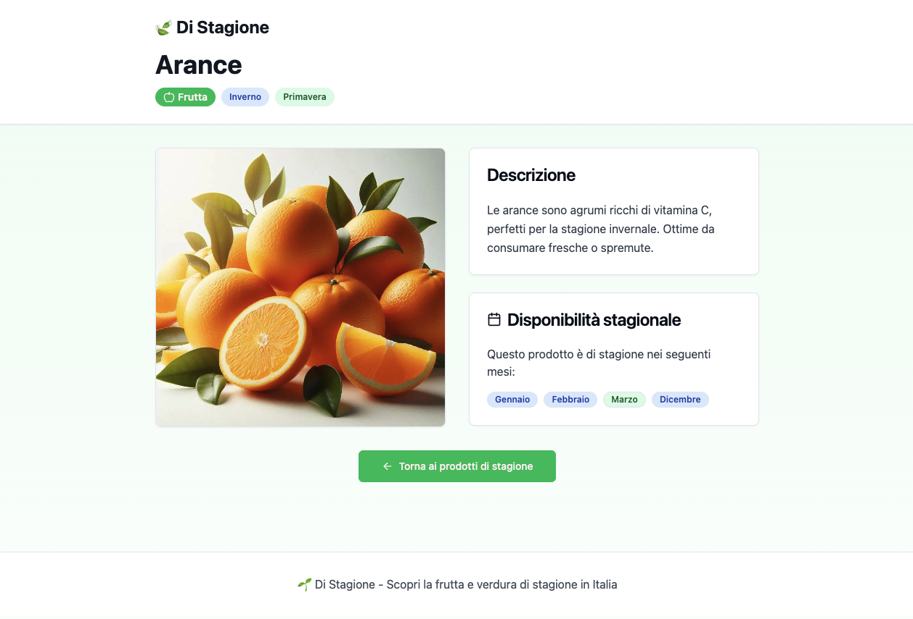
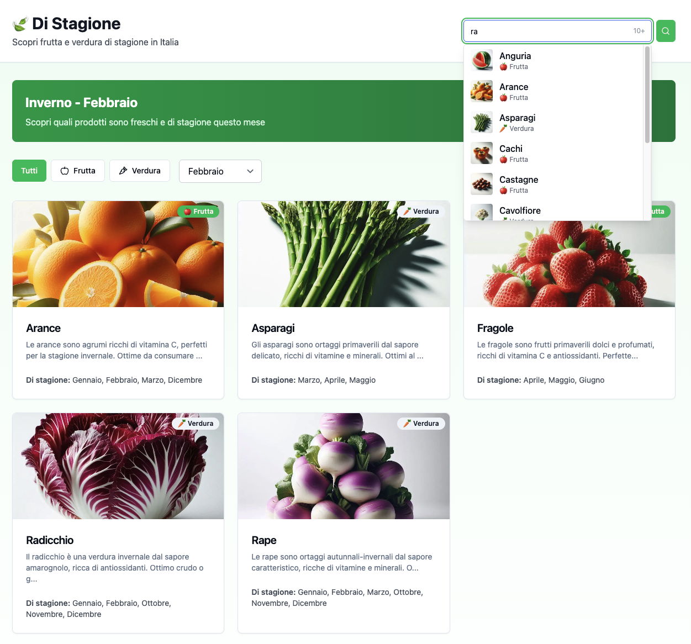

# 🍃 Di Stagione

[](https://app.netlify.com/projects/di-stagione/deploys)
[](LICENSE)
[](https://react.dev/)
[](https://vite.dev/)
[](https://tailwindcss.com/)

**Scopri frutta e verdura di stagione in Italia, mese per mese.**

Una web app moderna e veloce che cataloga 51 prodotti stagionali italiani, aiutandoti a scegliere cosa è fresco e locale in ogni periodo dell'anno.

🔗 **[Prova l'app live →](https://di-stagione.netlify.app/)**

---

## 📸 Screenshot

| Homepage con filtri e griglia prodotti | Pagina dettaglio prodotto |
|:---:|:---:|
|  |  |

| Autocomplete con navigazione da tastiera |
|:---:|
|  |

---

## ✨ Funzionalità principali

- **Catalogo stagionale** — 51 prodotti tra frutta e verdura, con descrizioni e immagini
- **Rilevamento automatico del mese** — la homepage mostra subito i prodotti del mese corrente
- **Filtri combinabili** — per tipo (frutta/verdura), mese e ricerca testuale
- **Autocomplete intelligente** — suggerimenti in tempo reale con anteprima immagini e navigazione da tastiera (frecce, Enter, Esc)
- **Badge interattivi** — nella pagina dettaglio, clicca un mese per vedere tutti i prodotti di quel periodo
- **Memoria della posizione** — quando torni dalla pagina dettaglio, la pagina è esattamente dove l'avevi lasciata
- **Design responsivo** — ottimizzato per mobile, tablet e desktop
- **SEO-friendly** — meta tag dinamici, URL semantici con slug, HTML semantico

## 🛠️ Tech Stack

| Categoria | Tecnologia |
|---|---|
| **Framework** | React 18 |
| **Routing** | React Router DOM v7 |
| **Build Tool** | Vite 7 |
| **Styling** | Tailwind CSS 4 |
| **Componenti UI** | Shadcn UI |
| **Icone** | Lucide React |
| **SEO** | React Helmet Async |
| **Deploy** | Netlify |

## 🏗️ Architettura

L'app segue un'architettura **component-driven** con separazione chiara tra pagine, componenti riutilizzabili e logica dati:

```
src/
├── components/
│   ├── ui/                     # Componenti Shadcn UI (autocomplete, badge, card, button, input)
│   └── ScrollToTop.jsx         # Pulsante floating scroll-to-top
├── hooks/
│   └── useProducts.js          # Custom hook per fetch e gestione prodotti
├── lib/
│   └── utils.js                # Utility (class name merging)
├── pages/
│   ├── ProductsIndex.jsx       # Homepage con filtri, ricerca e griglia
│   └── ProductShow.jsx         # Pagina dettaglio prodotto
├── index.css                   # Stili Tailwind
└── main.jsx                    # Entry point con React Router
```

**Scelte architetturali:**
- **Dati statici in JSON** — nessun backend necessario, caricamento istantaneo
- **Filtro client-side con `useMemo`** — ricerca e filtri senza latenza di rete
- **Componente Autocomplete custom** — con debounce visivo, limite suggerimenti e keyboard navigation
- **Scroll position restoration** — stato preservato via `sessionStorage` per UX fluida

## 🚀 Avvio rapido

```bash
# Clona il repository
git clone https://github.com/E-Lop/di-stagione.git
cd di-stagione

# Installa le dipendenze
npm install

# Avvia il server di sviluppo
npm run dev
```

L'app sarà disponibile su `http://localhost:5173`

### Build di produzione

```bash
npm run build      # genera i file ottimizzati in dist/
npm run preview    # anteprima locale della build
```

## 🌐 Deploy

L'app è deployata su **Netlify** con build automatica ad ogni push:

- Build command: `npm run build`
- Publish directory: `dist`
- SPA redirect configurato in `netlify.toml`

## 📊 Struttura dati

Ogni prodotto nel catalogo (`public/data/products.json`) ha questa struttura:

```json
{
  "id": 1,
  "name": "Pomodori",
  "name_en": "Tomatoes",
  "type": "verdura",
  "description": "Descrizione del prodotto",
  "image": "/images/pomodori.jpg",
  "slug": "pomodori",
  "months": [6, 7, 8, 9]
}
```

## 🎯 Possibili sviluppi futuri

- [ ] Dark mode
- [ ] Ricette stagionali associate ai prodotti
- [ ] Export lista della spesa
- [ ] Mappa dei mercati locali
- [ ] PWA con supporto offline

## 📝 Licenza

Distribuito sotto licenza [MIT](LICENSE).

---

Realizzato con ❤️ per promuovere il consumo di prodotti locali e stagionali in Italia.
